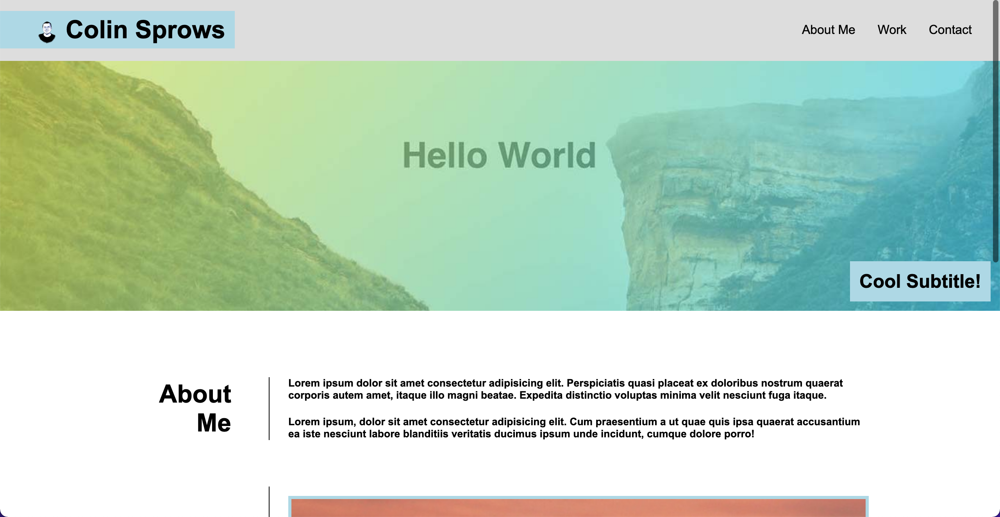

# Colin Sprows Portfolio

## Description

I created this portfolio to showcase some of the work I've worked on. I built it to make it easier for people to visualize my skills as a coder. I learned a lot about coding from scratch and properly creating responsiveness for a webpage.

## Installation

To install/launch the project, simply navigate to the webpage!

## Usage

Click a link on the top right to jump to the corresponding section!

## License

N/A

## How to Contribute

N/A

## Tests

N/A